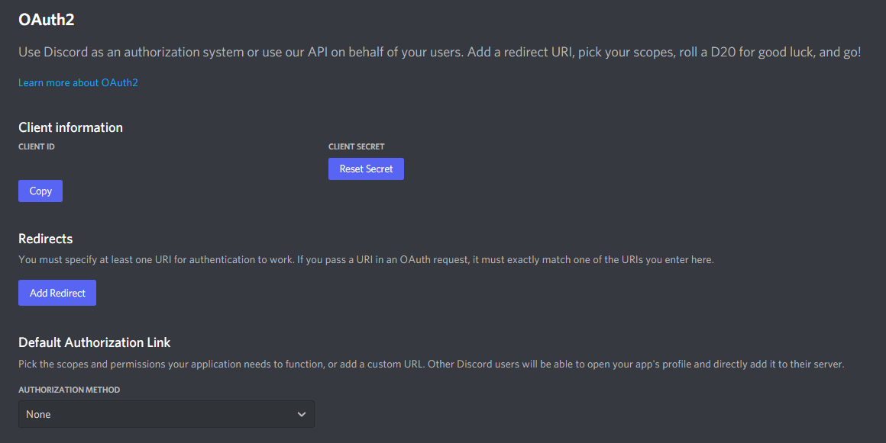

# Creating a Discord Bot Token

## Getting your Discord token

Before you start coding, you need to create and register your bot in the Discord developer portal. You can then add this bot to your Discord server.

To create a bot:

1. Make sure you’re logged on to the [Discord website](https://discord.com/).
2. Navigate to the [application page](https://discord.com/developers/applications)
3. Click on the “New Application” button.

    

4. Give the application a name and click “Create”.

    

5. Navigate to the “Bot” tab to configure it.
6. Make sure that Public Bot is ticked if you want others to invite your bot.
    - You should also make sure that `Require OAuth2 Code Grant` is unchecked unless you are developing a service that needs it. If you’re unsure, then leave it unchecked.

     

7. Copy the token using the “Copy” button.

    ???+ warning
        It should be worth noting that this token is essentially your bot’s password. You should never share this with someone else. In doing so, someone can log in to your bot and do malicious things, such as leaving servers, banning all members inside a server, or pinging everyone maliciously.

        The possibilities are endless, so do not share this token.

        If you accidentally leaked your token, click the “Regenerate” button as soon as possible. This revokes your old token and re-generates a new one. Now you need to use the new token to log in.

And that’s it. You now have a bot account and you can log in with that token.

## Adding the Bot to Your Server

So you’ve made a Bot User but it’s not actually in any server.

If you want to invite your bot you must create an invite URL for it.

1. Make sure you've [created your token](#getting-your-discord-token).
2. Navigate to the [application page](https://discord.com/developers/applications).
3. Click on your bot’s page.
4. Go to the “OAuth2 > URL Generator” tab.

    

5. Tick the `bot` checkbox under “scopes”. If your bot uses slash commands, also select `applications.commands`. You can read more about scopes and which you need for your application [here](https://discord.com/developers/docs/topics/oauth2#shared-resources-oauth2-scopes).
6. Choose the permissions required for your bot to function in the "Bot Permissions" section.
7. Copy and paste the resulting URL in your browser. Choose a server to invite the bot to, and click "Authorize".

???+ note
    Bot owners must have 2FA enabled for certain actions and permissions when added to servers that have Server-Wide 2FA enabled. Check the 2FA support page for more information.
